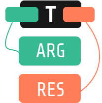

    

| [English](README.md) | Português |
| --- | --- |

---

TARGRES, ou **T**ree-based **Arg**umetation **Res**olution (Resolução de Argumentações baseada em Árvores), é um método para determinar a robustez de teses discutidas em grupo, onde argumentos e contra-argumentos podem ser representados como galhos numa árvore. Com base no desequilíbrio entre a robustez de argumentação pró-tese e anti-tese, TARGRES finalmente confirma ou refuta a tese - tudo isso, claro, baseando-se nas opiniões presentes nos dados.

# Introdução

A resolução de debates ajuda a moldar o progresso social e científico desde o início dos tempos. Na era atual ela não é só importante offline - é, também, uma das bases da própria internet:

- StackOverflow e [mais de cem irmãos](https://stackexchange.com/sites)
- [um](http://www.reddit.com/r/explainlikeimfive+doesanybodyelse+tipofmytongue+answers+explainlikeIAmA+relationship_advice+whatisthisthing+techsupport+explainlikeimcalvin+whatsthisbug+tipofmypenis+whatstheword+homeworkhelp+relationshipadvice+species+NoStupidQuestions) [grande](http://www.reddit.com/r/AskReddit+AskScience+AskHistorians+AskWomen+AskMen+AskCulinary+TrueAskReddit+AskSocialScience+AskEngineers+AskPhilosophy+AskScienceFiction+Ask_Politics+AskAcademia+AskTransgender+AskComputerScience+AskDrugs+AskFeminists+AskGames+AskPhotography+AskUk+AskStatistics+AskSciTech+AskSciTech+askGSM+AskModerators) [pedaço](http://www.reddit.com/r/help+findareddit+modhelp+csshelp+bugs+RESissues+askmoderators+aboutreddit) do Reddit
- Quora

... e os vários fóruns similares. O mundo onipresente de Q&A (_Questions & Answers_, Perguntas & Respostas) foi inteiramente construído para prosperar sob a resolução de debates raramente unilaterais. O objetivo de TARGRES é direcionar o caminho à inteligência que pode receber um **debate como
input**, e **como output a resposta mais robusta** - e provavelmente correta.  

Através de um [dataset custom](./data) com discussões vindas do site [Kialo](https://kialo.com), este estudo almeja entender e rankear a robustez de argumentações em qualquer discussão, usando uma combinação de contexto, impacto social localizado (i.e. pontuação dos argumentos por outros usuários) e ramificações (prós \& contras) decorrentes de cada argumento. 

# Conceito
[TARGRES Paper](./TARGRES_Project_Paper.pdf) contém a pesquisa completa, construtos matemáticos por trás de TARGRES e o benchmark dos modelos construídos.

# Como usar
Em [TARGRES.ipynb](./TARGRES.ipynb) está o guia sequencial e documentado de como utilizar o algoritmo.

# Rodando o source code

O único passo necessário:  
`pip install -r requirements.txt`

> O notebook presume uma [instalação de pytorch com CUDA habilitado](https://pytorch.org/get-started/locally/#with-cuda-1) para rodar o processo de embedding do BERT. Uma GPU com ~2.5k CUDA cores e 12GB RAM (compute 3.7) levou ~1h30m para processar 100k linhas de dados.

Após instalação com sucesso, a execução de [TARGRES.ipynb](./TARGRES.ipynb) é sequencial. Recomenda-se pular o scraping e pré-processamento, já que a seção "5. Intelligence Architecture" carregará o dataset que está em `data/clean_claims_df.pkl`.

# Próximos passos

- [ ] Uma interface aberta na qual interagir com TARGRES.
- [ ] Automação de releases (e.g. através de GitHub Actions).
- [ ] Normalizar a equidade (_fairness_), como feito em [scikit-fairness](https://github.com/koaning/scikit-fairness).
    - Em conjunto com o time da própria Kialo, ou deduzindo a demografia dos usuários do site.
- [ ] Extrapolar TARGRES para dados externos (StackExchange ou Reddit)